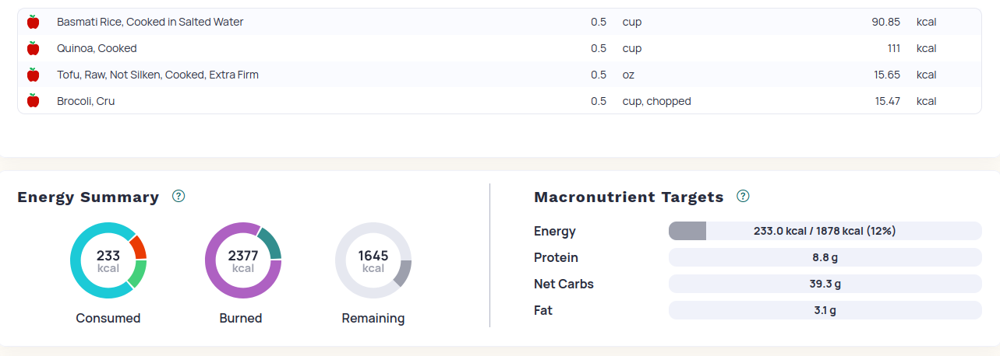

# Quick Eats
## RICE COOKER QUICK EATS
* `PREP: 5 minutes`
* `COOK TIME: 30 minutes`

INSTRUCTIONS

* Add 1/2 cup of Rice (rinse several times)
* Add 1/2 cup of Quinoa
* Add 1/2 cup of Brocoli
* Add 1/2 cup of Mock Meat 
* Add 1/2 cup of Flavouring 

BONUS

* Put food in a Wrap for a quick burito
* Add some dressing and or nutritional yeast

STATS

